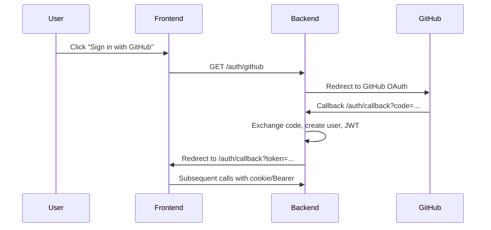
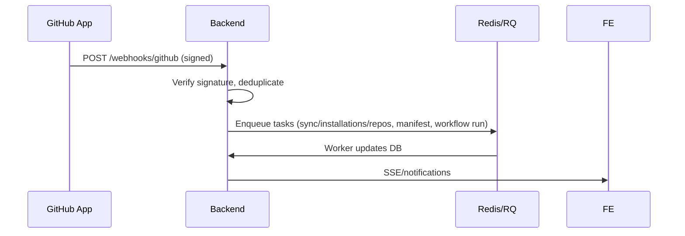

# Architecture

## Overview

QuantumReview consists of a FastAPI backend, a React frontend, PostgreSQL for persistence, Redis for queues/cache, and GitHub integrations (OAuth + App).

```mermaid
graph TD
  FE[Frontend (React)] --> API[FastAPI Backend]
  API --> DB[(PostgreSQL)]
  API --> REDIS[(Redis)]
  API --> GH[GitHub App + OAuth]
```

## Auth Flow



## Webhooks Flow



## Modules

- `app/api/auth.py` – OAuth endpoints and session creation
- `app/api/github.py` – installations and repos endpoints
- `app/webhooks/github.py` – webhook signature verification and dispatch
- `app/services/*` – business logic (checklist, CI mapping, notifications)
- `app/integrations/github/*` – GitHub App client helpers
- `app/models/*` – SQLAlchemy models (users, repos, issues, PRs, health)
- `frontend/src/*` – pages, components, hooks

